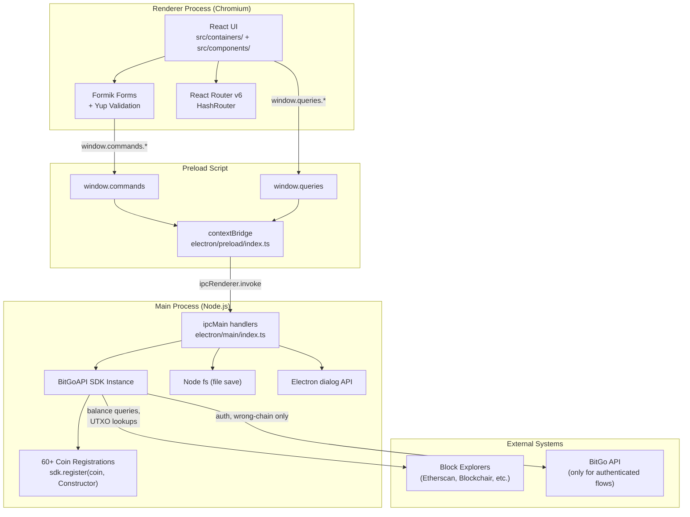
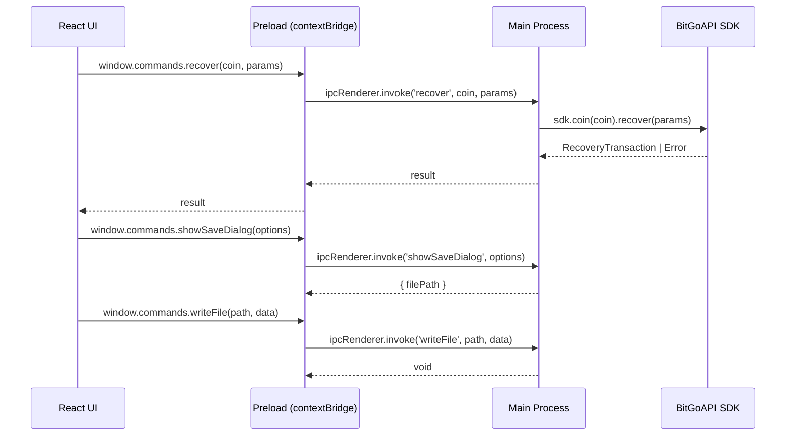
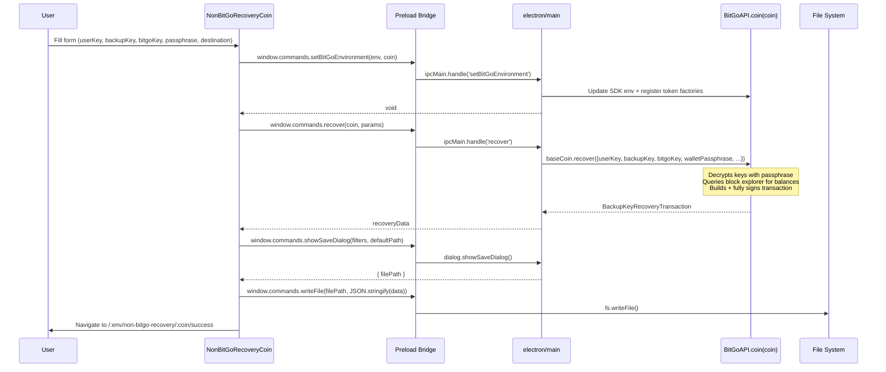
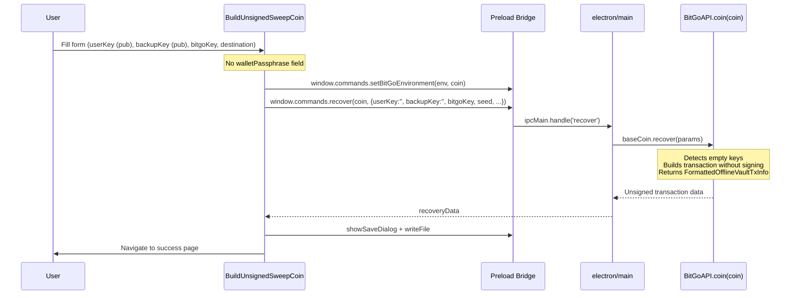
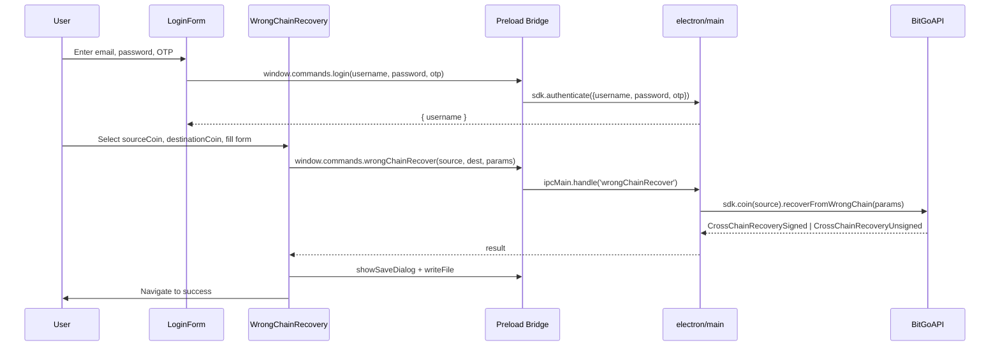
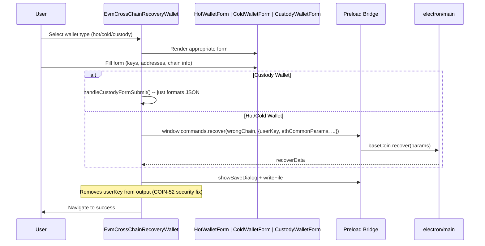
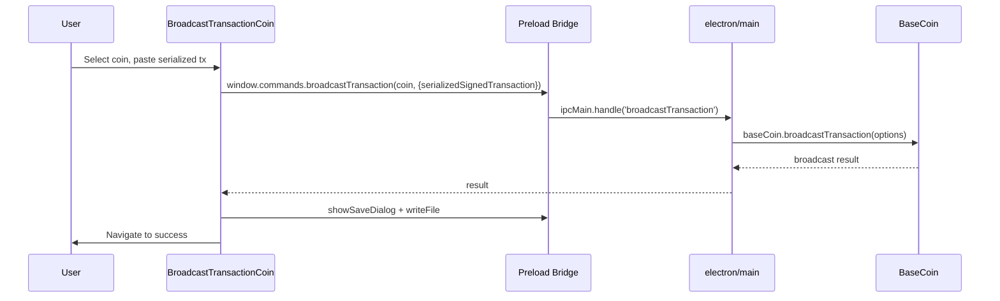
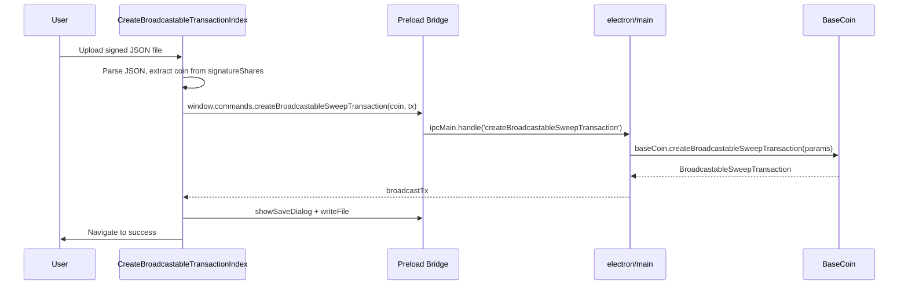
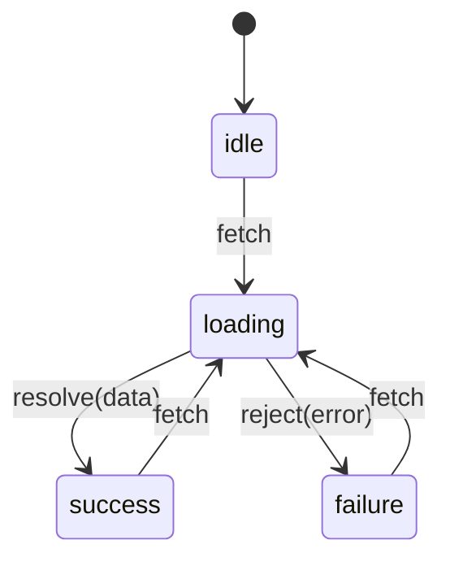
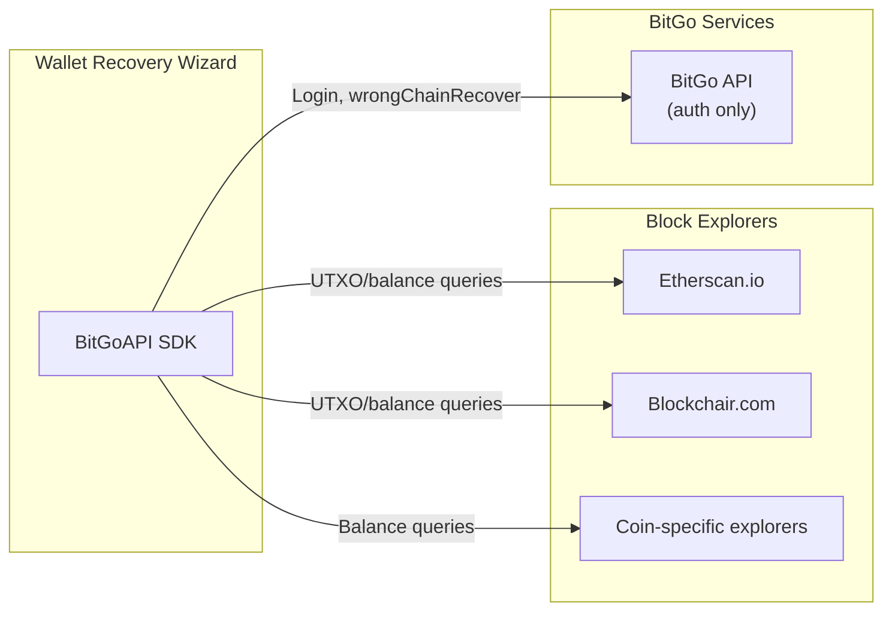

# DESIGN.md -- BitGo Wallet Recovery Wizard

> **Last updated:** 2026-03-24
> **Repository:** `wallet-recovery-wizard`

---

## Table of Contents

- [1. Overview](#1-overview)
- [2. Architecture](#2-architecture)
- [3. Important Flows](#3-important-flows)
- [4. Data Models](#4-data-models)
- [5. External Systems](#5-external-systems)
- [6. Key Design Decisions](#6-key-design-decisions)
- [7. Component Library](#7-component-library)
- [8. Configuration and Environment](#8-configuration-and-environment)
- [9. Build, Test, and Deploy](#9-build-test-and-deploy)
- [10. Gotchas and Known Quirks](#10-gotchas-and-known-quirks)

---

## 1. Overview

**What it does:** The Wallet Recovery Wizard (WRW) is a desktop application that helps BitGo customers recover cryptocurrency funds from BitGo wallets without relying on BitGo's online services. It supports over 60 coins and tokens across UTXO, EVM, and account-based blockchains.

**Who uses it:** BitGo enterprise customers who need to perform self-custody fund recovery -- typically during key compromise scenarios, wallet migration, or when BitGo services are unavailable.

**Key capability:** Most recovery operations work entirely offline. The application builds and optionally signs recovery transactions locally using the BitGo SDK, then saves the resulting JSON to disk for the user to broadcast independently.

**Tech stack:** Electron 22 + Vite 3 + React 18 + TypeScript 5.9, styled with Tailwind CSS, using Formik + Yup for form validation and the BitGo SDK (`@bitgo/sdk-*`) for all cryptographic and blockchain operations.

---

## 2. Architecture

### 2.1 High-Level Architecture

The application follows a standard Electron two-process model: a Node.js main process that performs cryptographic operations through the BitGo SDK, and a Chromium renderer process that presents the React UI. The two processes communicate exclusively through Electron's IPC invoke/handle pattern, with a typed preload bridge in between.



### 2.2 Process Model

The IPC boundary is the most important architectural seam in this application. The preload script (`electron/preload/index.ts`) defines two namespaces exposed to the renderer:

- **`window.commands`** -- mutating operations: `recover`, `wrongChainRecover`, `broadcastTransaction`, `recoverConsolidations`, `createBroadcastableSweepTransaction`, `login`, `logout`, `setBitGoEnvironment`, `writeFile`, `showSaveDialog`, `showMessageBox`, `unlock`, `sweepV1`
- **`window.queries`** -- read-only operations: `getVersion`, `getChain`, `deriveKeyWithSeed`, `deriveKeyByPath`, `getUser`, `isSdkAuthenticated`

Every call crosses the IPC boundary via `ipcRenderer.invoke` / `ipcMain.handle` and is fully typed through augmented Electron namespace declarations in the preload script.



### 2.3 Project Structure

```
wallet-recovery-wizard/
├── electron/
│   ├── main/index.ts           # Main process: SDK init, coin registration, IPC handlers
│   ├── preload/index.ts        # Preload: typed IPC bridge (contextBridge)
│   ├── types.ts                # Shared types for broadcastable/consolidation operations
│   └── resources/              # App icons and macOS entitlements
├── src/
│   ├── main.tsx                # React entry point (HashRouter + App)
│   ├── containers/
│   │   ├── App.tsx             # Route definitions (all 8 top-level routes)
│   │   ├── Home.tsx            # Landing page with environment selector
│   │   ├── Auth/               # Authenticated/Unauthenticated layout wrappers
│   │   ├── Login/              # BitGo login form (username + password + OTP)
│   │   ├── NonBitGoRecoveryCoin/       # ~25 coin-specific recovery forms
│   │   ├── NonBitGoRecoveryIndex/      # Coin selector for Non-BitGo recovery
│   │   ├── BuildUnsignedSweepCoin/     # ~25 coin-specific unsigned sweep forms
│   │   ├── BuildUnsignedSweepIndex/    # Coin selector for unsigned sweep
│   │   ├── BuildUnsignedConsolidation/ # Consolidation forms (TRX, ADA, DOT, SOL, etc.)
│   │   ├── BroadcastTransactionCoin/   # Broadcast forms (HBAR, ALGO, SUI)
│   │   ├── BroadcastTransactionIndex/  # Coin selector for broadcast
│   │   ├── CreateBroadcastableTransaction/ # MPC signed tx to broadcastable converter
│   │   ├── EvmCrossChainRecoveryIndex/ # Wallet type selector for EVM cross-chain
│   │   ├── EvmCrossChainRecoveryWallet/# Hot/Cold/Custody wallet forms
│   │   ├── WrongChainRecovery/         # Source/destination coin picker + form
│   │   ├── V1BtcSweep/                # Legacy V1 BTC wallet sweep
│   │   ├── SuccessfulRecovery/         # Success page with celebration animation
│   │   └── SuccessfulBroadcastTransaction/ # Broadcast success page
│   ├── components/             # Reusable UI components (20+)
│   ├── helpers/
│   │   ├── index.ts            # Utility functions (recoverWithToken, toWei, etc.)
│   │   └── config.ts           # All coin metadata, feature lists, environment configs
│   ├── contexts/               # AlertBannerContext (React context for error banners)
│   ├── hooks/                  # useLocalStorageState custom hook
│   ├── reducers/               # asyncDataReducer (idle/loading/success/failure FSM)
│   ├── utils/types.ts          # Shared TypeScript type aliases for SDK operations
│   └── assets/styles/index.css # Tailwind CSS entry point
├── e2e/home.spec.ts            # Playwright E2E test (title check)
├── .storybook/                 # Storybook configuration + custom React Router addon
├── scripts/                    # Build helpers (icon generation, version bumping, etc.)
├── docs/RECOVERY_FLOWS.md      # Internal documentation on Non-BitGo vs Unsigned Sweep
├── vite.config.ts              # Vite + Electron plugin configuration
├── electron-builder.json5      # Electron Builder packaging config (Mac, Win, Linux)
├── package.json                # 60+ @bitgo/sdk-coin-* dependencies
└── *.md                        # Per-coin recovery instruction docs (ADA, SOL, DOT, etc.)
```

---

## 3. Important Flows

### 3.1 Non-BitGo Recovery (Fully-Signed)

This is the primary recovery flow. The user provides their encrypted private keys (from their BitGo Key Card) and wallet passphrase. The SDK decrypts the keys locally, builds the recovery transaction, signs it with both user and backup keys, and returns a fully-signed transaction that can be broadcast immediately.



**Coins supported:** BTC, BCH, LTC, XRP, XLM, DASH, ZEC, BTG, ETH, EOS, TRX, AVAXC, DOT, ADA, SOL, HBAR, ALGO, NEAR, ICP, POLYX, TAO, VET, and 30+ EVM-compatible chains and tokens.

### 3.2 Build Unsigned Sweep

This flow is for cold wallets or custody scenarios where the user does not have access to private keys. Only public keys are provided. The SDK builds the transaction but does not sign it.



**Key distinction from Non-BitGo Recovery:** Both flows call the same `baseCoin.recover()` SDK method. The SDK internally detects whether private keys were provided.

### 3.3 Wrong Chain Recovery (Authenticated)

This is the only flow that requires BitGo authentication. It recovers funds accidentally sent to an address on the wrong blockchain.



### 3.4 EVM Cross-Chain Recovery

Handles EVM-specific cross-chain recovery for hot, cold, and custody wallets. Funds sent to the wrong EVM-compatible chain can be recovered by providing wallet contract addresses and keys.



### 3.5 Broadcast Transaction

For coins that require a separate broadcast step (HBAR, ALGO, SUI), this flow takes a serialized signed transaction and broadcasts it to the network.



### 3.6 Create Broadcastable MPC Transaction

Converts MPC-signed transactions into broadcastable format. The user uploads a JSON file containing signature shares, and the SDK assembles them into a complete transaction.



**Supported coins:** ADA, DOT, TAO, POLYX, SOL, SUI, ICP, VET, NEAR, ETH, TON.

---

## 4. Data Models

### 4.1 Coin Metadata

The central registry of supported coins lives in `src/helpers/config.ts`:

```typescript
type CoinMetadata = {
  Title: string;                    // e.g. "ETH"
  Description: string;              // e.g. "Ethereum"
  value: string;                    // coin identifier used in routing and SDK calls
  Icon: string;                     // icon key for CryptocurrencyIcon component
  ApiKeyProvider?: string;          // e.g. "etherscan.io"
  isTssSupported?: boolean;
  minGasLimit?: string;
  defaultGasLimit?: string;
  defaultGasLimitNum?: number;
  defaultMaxFeePerGas?: number;     // EIP-1559 (in Gwei)
  defaultMaxPriorityFeePerGas?: number;
  defaultGasPrice?: number;
};
```

Coins are organized into per-feature, per-environment arrays:
- `nonBitgoRecoveryCoins[env]` -- coins for Non-BitGo Recovery
- `buildUnsignedSweepCoins[env]` -- coins for Unsigned Sweep
- `buildUnsignedConsolidationCoins[env]` -- coins for consolidation
- `broadcastTransactionCoins[env]` -- coins for broadcast
- `wrongChainRecoveryCoins[env]` -- coin pairs for wrong-chain recovery

### 4.2 IPC Commands and Queries

**Commands (mutating):**

| Channel | Parameters | Return Type |
|---------|-----------|-------------|
| `recover` | `coin, params` | `BackupKeyRecoveryTransaction \| FormattedOfflineVaultTxInfo` |
| `wrongChainRecover` | `sourceCoin, destinationCoin, params` | `CrossChainRecoverySigned \| CrossChainRecoveryUnsigned` |
| `broadcastTransaction` | `coin, options` | `BroadcastTransactionResult` |
| `createBroadcastableSweepTransaction` | `coin, params` | `BroadcastableSweepTransaction` |
| `recoverConsolidations` | `coin, params` | `ConsolidationRecoveryBatch` |
| `setBitGoEnvironment` | `environment, coin?, apiKey?` | `void` |
| `login` | `username, password, otp` | `{ username }` |
| `logout` | -- | `undefined` |
| `writeFile` | `file, data, options?` | `void` |
| `showSaveDialog` | `options` | `SaveDialogReturnValue` |
| `showMessageBox` | `options` | `MessageBoxReturnValue` |

**Queries (read-only):**

| Channel | Parameters | Return Type |
|---------|-----------|-------------|
| `getVersion` | -- | `string` |
| `getChain` | `coin` | `string` |
| `deriveKeyWithSeed` | `coin, key, seed` | `{ key, derivationPath }` |
| `deriveKeyByPath` | `key, id` | `string` |
| `getUser` | -- | `{ username }` |
| `isSdkAuthenticated` | -- | `boolean` |

### 4.3 Async Data Reducer



---

## 5. External Systems

| System | Purpose | When Used | Online Required? |
|--------|---------|-----------|-----------------|
| **BitGo API** | Authentication, wrong-chain recovery | Wrong Chain Recovery, V1BTC Sweep | Yes |
| **Block explorers** (Etherscan, Blockchair, etc.) | UTXO lookups, balance queries | Non-BitGo Recovery, Unsigned Sweep | Yes |
| **Blockchain nodes** (via SDK) | Transaction broadcast | Broadcast Transaction flow | Yes |



---

## 6. Key Design Decisions

### 6.1 Single SDK Method for Two Recovery Modes

**Decision:** Both Non-BitGo Recovery (signed) and Build Unsigned Sweep (unsigned) call the same `baseCoin.recover()` method. The SDK internally determines whether to sign based on the presence of private keys.

**Rationale:** Keeps the WRW thin -- it does not implement any cryptographic logic.

**Consequence:** Form components in `NonBitGoRecoveryCoin/` and `BuildUnsignedSweepCoin/` look similar but differ in which fields are shown. The `isRecoveryTransaction()` helper checks 10 different possible field names because different coin SDKs return different shapes.

### 6.2 Massive Coin Registration at Startup

**Decision:** The main process statically imports and registers 120+ coin constructors at module load time.

**Rationale:** The BitGoAPI SDK uses a factory pattern where each coin must be registered before use.

**Consequence:** Larger cold start time and memory footprint. Adding a new coin requires adding its SDK package to `package.json` and its registration call in `electron/main/index.ts`.

### 6.3 Environment-Gated Coin Lists

**Decision:** Each recovery feature maintains separate `prod` and `test` coin arrays in `src/helpers/config.ts`.

**Rationale:** Not all coins have testnet support. The environment selection propagates through URL routing (`/:env/...`).

**Consequence:** The config file is ~2000 lines, mostly coin metadata definitions.

### 6.4 Electron with Context Isolation

**Decision:** `contextIsolation: true` and `nodeIntegration: false` with a strictly typed preload bridge.

**Rationale:** Security best practice for an app that handles cryptographic keys. The renderer never has direct access to Node.js APIs or the BitGo SDK.

### 6.5 Coin-Specific Form Components via Switch Statement

**Decision:** Each coin-specific container uses a large `switch` statement on the `coin` URL parameter.

**Rationale:** Different coins require fundamentally different form fields.

**Consequence:** Switch blocks are 500+ lines. Adding a new coin means adding a case in up to 3 switch statements plus creating the form component.

---

## 7. Component Library

| Component | Purpose |
|-----------|---------|
| `AlertBanner` | Error/warning banner (driven by `AlertBannerContext`) |
| `BackToHomeHeader` | Navigation header with back link |
| `Button` | Polymorphic button (primary/secondary variants) |
| `CoinsSelectAutocomplete` | Searchable coin dropdown with icons |
| `CryptocurrencyIcon` | Coin icon renderer (static + dynamic) |
| `FormikTextfield` | Formik-integrated text input |
| `FormikSelectfield` | Formik-integrated select dropdown |
| `FormikTextarea` | Formik-integrated textarea |
| `FormikFilefield` | Formik-integrated file upload |
| `LinkCard` / `LinkCardItem` | Card-based navigation links (Home page) |
| `PageLayout` | Standard page wrapper with title and description |
| `SelectAutocomplete` | Generic searchable dropdown |
| `Notice` | Informational notice box |
| `WalletTypeSelect` | Wallet type radio/select for EVM CCR |

---

## 8. Configuration and Environment

### Build Tooling

| Tool | Version | Purpose |
|------|---------|---------|
| Vite | 3.2.8 | Dev server and bundler for renderer |
| Electron | 22 | Desktop application framework |
| electron-builder | 24.9.1 | Packaging (Mac DMG, Windows NSIS, Linux DEB) |
| TypeScript | 5.9.3 | Type checking |
| Tailwind CSS | 3.2.4 | Utility-first CSS (prefixed `tw-`) |
| Formik | 2.2.9 | Form state management |
| Yup | 0.32.11 | Form validation schemas |
| Storybook | 6.5.16 | Component development |
| Vitest | 0.25.5 | Unit testing |
| Playwright | 1.28.1 | E2E testing |

### Environment

- **Node:** 20.10.0 | **npm:** 10.2.3
- **Vite dev server:** `http://127.0.0.1:7777`
- **Path alias:** `~` maps to `src/`

---

## 9. Build, Test, and Deploy

```bash
npm install
npm run dev          # Vite dev server + Electron
npm test             # Vitest unit tests
npm run storybook    # Component dev at localhost:6006
npm run build        # TypeScript + Vite + electron-builder package
```

Releases are triggered via GitHub Actions. The workflow creates a draft release with packaged artifacts (Mac, Windows, Linux).

---

## 10. Gotchas and Known Quirks

1. **Duplicate type definitions:** Four overlapping type files (`electron/types.ts`, `electron/preload/index.ts`, `src/preload.d.ts`, `src/utils/types.ts`) can drift out of sync. The preload script is the source of truth.

2. **`setBitGoEnvironment` does more than set the environment:** It re-creates the entire `BitGoAPI` instance, registers token factories, and must be called before any `recover` or `broadcast` call.

3. **BSC and ETC do not support EIP-1559:** The `getEip1559Params()` helper silently returns `undefined` for these chains, falling back to legacy gas pricing.

4. **The `isRecoveryTransaction()` check is deliberately broad:** It checks 10 different field names because different coin SDKs return different result shapes. A new coin SDK with a different field name would fail silently.

5. **User key removal from EVM cross-chain recovery output:** `EvmCrossChainRecoveryWallet.tsx` explicitly deletes the `userKey` from output JSON (COIN-52 security fix). This is the only flow that does this.

6. **Large `switch` statements are the extension point:** Adding a new coin requires modifying switch statements in 2-3 container files (750+ lines each). The `ONBOARD_COIN.md` documents this process.

7. **The application starts with `env: 'test'` by default.** First-time users are on testnet.

8. **`showMessageBox` for derivation path disambiguation:** When a user enters a value starting with `m/` in a key ID field, an Electron dialog pops up asking whether it's a derivation path or a seed.
